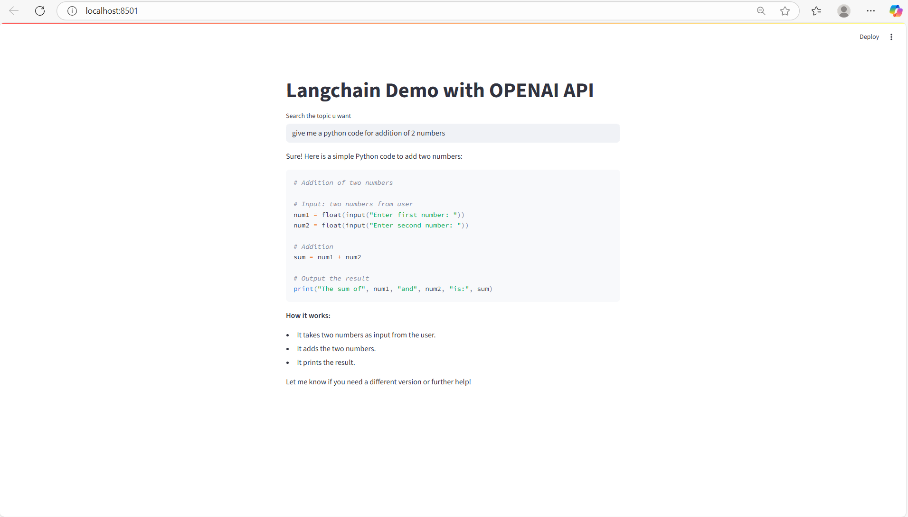

# LangChain ChatBot with Azure OpenAI and Streamlit

This project demonstrates a simple chatbot application built using **LangChain**, **Azure OpenAI**, and **Streamlit**. The application allows users to input queries through a web interface, processes them using a language model hosted on Azure OpenAI, and displays the responses in real-time. The project also integrates **LangSmith** for tracing, monitoring API calls, and analyzing metrics such as token usage, latency, and costs.

This README is structured as a learning guide to help you build your first LangChain application step-by-step, understand the core components, and learn how to monitor and trace the application's behavior using LangSmith.

## Table of Contents
- [Project Overview](#project-overview)
- [Features](#features)
- [Tech Stack](#tech-stack)
- [Building Your First LangChain Application: Step-by-Step Guide](#building-your-first-langchain-application-step-by-step-guide)
- [Understanding the Core Components](#understanding-the-core-components)
- [Setup Instructions](#setup-instructions)
- [Environment Variables](#environment-variables)
- [How It Works](#how-it-works)
- [Running the Application](#running-the-application)
- [Monitoring and Tracing with LangSmith](#monitoring-and-tracing-with-langsmith)
- [Estimating API Costs](#estimating-api-costs)
- [File Structure](#file-structure)
- [Contributing](#contributing)
- [License](#license)

## Project Overview
This project creates a user-friendly chatbot interface where users can input questions or topics, and the application responds with answers generated by the Azure OpenAI model. The LangChain framework is used to manage the prompt template and chain the components (prompt, language model, and output parser). Streamlit provides a simple web-based UI for user interaction. Additionally, LangSmith is integrated to trace the entire process, allowing you to monitor inputs, outputs, token usage, latency, and other metrics.

## Features
- **Interactive Chat Interface**: Users can input queries via a text box and receive responses instantly.
- **Azure OpenAI Integration**: Leverages Azure's hosted OpenAI models for natural language processing.
- **LangChain Framework**: Manages the conversation flow with prompt templates, language model calls, and output parsing.
- **LangSmith Tracing**: Tracks and monitors LangChain operations for debugging, performance analysis, and metrics like token usage and latency.
- **Environment Variable Management**: Securely handles API credentials using a `.env` file.

## Tech Stack
- **Python**: Core programming language.
- **LangChain**: Framework for building applications with language models.
- **Azure OpenAI**: Provides the language model for generating responses.
- **Streamlit**: Web framework for creating the user interface.
- **python-dotenv**: Loads environment variables from a `.env` file.
- **LangSmith**: Tool for tracing and debugging LangChain operations.

## Building Your First LangChain Application: Step-by-Step Guide
This section walks you through building a basic LangChain application from scratch, as if you're learning it for the first time. We'll cover importing libraries, setting up the prompt, integrating the LLM, parsing outputs, and chaining everything together.

1. **Install Required Libraries**:
   Start by installing the necessary packages:
   ```bash
   pip install langchain langchain-openai streamlit python-dotenv
   ```

2. **Load Environment Variables**:
   Use `python-dotenv` to load secrets from a `.env` file. This keeps your API keys secure.
   ```python
   from dotenv import load_dotenv
   import os

   load_dotenv(dotenv_path=r"\Langchain\.env")
   ```

3. **Set Up Azure OpenAI Credentials**:
   Retrieve your Azure OpenAI keys and validate them:
   ```python
   AZURE_KEY = os.getenv("AZURE_OPENAI_API_KEY")
   AZURE_ENDPOINT = os.getenv("AZURE_OPENAI_ENDPOINT")
   AZURE_DEPLOYMENT = os.getenv("AZURE_OPENAI_DEPLOYMENT_NAME")

   if not AZURE_KEY or not AZURE_ENDPOINT or not AZURE_DEPLOYMENT:
       raise ValueError("Azure OpenAI environment variables not set properly")
   ```

4. **Enable LangSmith Tracing**:
   To monitor your application, set up LangSmith:
   ```python
   os.environ["LANGSMITH_TRACING"] = "true"
   os.environ["LANGSMITH_API_KEY"] = os.getenv("LANGSMITH_API_KEY")
   os.environ["LANGSMITH_PROJECT"] = "ChatBot"
   ```

5. **Create a Prompt Template**:
   Use `ChatPromptTemplate` to define the structure of your prompts. This includes a system message for instructions and a placeholder for the user's query.
   ```python
   from langchain_core.prompts import ChatPromptTemplate, SystemMessagePromptTemplate, HumanMessagePromptTemplate

   prompt = ChatPromptTemplate.from_messages(
       [
           SystemMessagePromptTemplate.from_template("You are a helpful assistant. Please respond to the user queries"),
           HumanMessagePromptTemplate.from_template("{question}")
       ]
   )
   ```

6. **Initialize the Language Model (LLM)**:
   Set up the Azure OpenAI model using `AzureChatOpenAI`:
   ```python
   from langchain_openai import AzureChatOpenAI

   llm = AzureChatOpenAI(
       deployment_name=AZURE_DEPLOYMENT,
       openai_api_key=AZURE_KEY,
       azure_endpoint=AZURE_ENDPOINT,
       openai_api_version="2025-01-01-preview"
   )
   ```

7. **Set Up Output Parsing**:
   Use `StrOutputParser` to convert the LLM's response into a plain string:
   ```python
   from langchain_core.output_parsers import StrOutputParser

   output_parser = StrOutputParser()
   ```

8. **Chain the Components**:
   Create a runnable chain (a `RunnableSequence`) by piping the components together:
   ```python
   chain = prompt | llm | output_parser
   ```

9. **Build the Streamlit UI**:
   Create a simple web interface to interact with the chain:
   ```python
   import streamlit as st

   st.title('Langchain Demo with OPENAI API')
   input_text = st.text_input("Search the topic u want")

   if input_text:
       st.write(chain.invoke({'question': input_text}))
   ```

10. **Run the App**:
    Save this in `app.py` and run:
    ```bash
    streamlit run app.py
    ```

This completes your first LangChain application! You've built a chain that processes user input through a prompt, an LLM, and an output parser.

## Understanding the Core Components
- **RunnableSequence**: This is the chain created by `prompt | llm | output_parser`. It's a sequence of runnable components that process data step-by-step. The input flows from the prompt to the LLM, then to the parser.
- **ChatPromptTemplate**: A template for structuring chat messages. It combines a system message (e.g., "You are a helpful assistant") with the user's query to create a formatted prompt for the LLM.
- **AzureChatOpenAI**: The language model interface for Azure-hosted OpenAI models. It handles the API call to generate responses based on the prompt.
- **StrOutputParser**: A simple parser that extracts the text content from the LLM's response object, converting it into a plain string for display. It's useful for stripping away metadata and getting just the generated text.

To check inputs and outputs:
- **Input**: The user's query is passed as `{'question': input_text}` to `chain.invoke()`. In LangSmith traces, you'll see this as the input to the RunnableSequence.
- **Output**: The final string response after parsing. In traces, it's the output of the StrOutputParser.

## Setup Instructions
To run this project locally, follow these steps:

1. **Clone the Repository**:
   ```bash
   git clone <repository-url>
   cd <repository-folder>
   ```

2. **Install Dependencies**:
   Ensure you have Python 3.8+ installed. Then, install the required packages:
   ```bash
   pip install -r requirements.txt
   ```

3. **Create a `.env` File**:
   Create a `.env` file in the project root directory (`C:\Jasweer\my_project\Langchain\.env`) with the following variables:
   ```plaintext
   AZURE_OPENAI_API_KEY=<your-azure-openai-api-key>
   AZURE_OPENAI_ENDPOINT=<your-azure-openai-endpoint>
   AZURE_OPENAI_DEPLOYMENT_NAME=<your-deployment-name>
   LANGSMITH_API_KEY=<your-langsmith-api-key>
   ```

4. **Install Required Packages**:
   Ensure the following Python packages are installed:
   ```plaintext
   langchain
   langchain-openai
   streamlit
   python-dotenv
   ```

   You can install them using:
   ```bash
   pip install langchain langchain-openai streamlit python-dotenv
   ```

5. **Run the Application**:
   Start the Streamlit app:
   ```bash
   streamlit run app.py
   ```
   Replace `app.py` with the name of your Python script if different.

## Environment Variables
The application relies on the following environment variables, which must be set in the `.env` file:
- `AZURE_OPENAI_API_KEY`: Your Azure OpenAI API key.
- `AZURE_OPENAI_ENDPOINT`: The endpoint URL for your Azure OpenAI instance.
- `AZURE_OPENAI_DEPLOYMENT_NAME`: The name of the deployed Azure OpenAI model.
- `LANGSMITH_API_KEY`: Your LangSmith API key for tracing (optional, required for LangSmith integration).
- `LANGSMITH_TRACING`: Set to `"true"` to enable LangSmith tracing.
- `LANGSMITH_PROJECT`: The name of the LangSmith project (e.g., `"ChatBot"`).

Ensure these variables are correctly set, or the application will raise a `ValueError`.

## How It Works
1. **User Input**: The user enters a query through the Streamlit web interface.
2. **Prompt Template**: The input is formatted using a `ChatPromptTemplate` from LangChain, which includes a system message ("You are a helpful assistant") and the user's query.
3. **Azure OpenAI Model**: The formatted prompt is sent to the Azure OpenAI model using the `AzureChatOpenAI` class.
4. **Output Parsing**: The model's response is parsed using `StrOutputParser` to extract the text output.
5. **Response Display**: The parsed response is displayed on the Streamlit interface.
6. **LangSmith Tracing**: All LangChain operations are tracked via LangSmith for debugging and monitoring.

The chain is constructed as `prompt | llm | output_parser`, which processes the input through the prompt template, the language model, and the output parser sequentially. This forms a `RunnableSequence` that traces the full flow.

## Running the Application
1. Ensure the `.env` file is configured with valid credentials.
2. Run the Streamlit app:
   ```bash
   streamlit run app.py
   ```
3. Open your browser to the provided URL (usually `http://localhost:8501`).
4. Enter a query in the text input field, and the chatbot will respond with answers generated by the Azure OpenAI model.
- _Landing Page_
  
## Monitoring and Tracing with LangSmith
LangSmith provides detailed tracing for your LangChain application. Once tracing is enabled (via environment variables), every invocation of the chain creates a trace in the LangSmith dashboard.

### How to Monitor API Calls and Traces
1. **Access the LangSmith Dashboard**: Log in to [LangSmith](https://smith.langchain.com/) with your API key. Navigate to the project (e.g., "ChatBot").
2. **View Traces**:
   - Each run of the chain appears as a trace.
   - The trace shows the complete flow: `RunnableSequence` → `ChatPromptTemplate` → `AzureChatOpenAI` → `StrOutputParser`.

3. **Check Inputs and Outputs**:
   - In the trace details, expand each component:
     - **ChatPromptTemplate**: Input is the user's query; output is the formatted prompt (system + human messages).
     - **AzureChatOpenAI**: Input is the formatted prompt; output is the LLM's response object (including generated text and metadata).
     - **StrOutputParser**: Input is the LLM's response; output is the plain string text.
4. **Token Usage**:
   - Under the `AzureChatOpenAI` step, look for metrics like "Prompt Tokens" (tokens in the input prompt) and "Completion Tokens" (tokens in the generated response). Total tokens = prompt + completion.
- Trace Page, Input and Output & Token Usage_
  
5. **Latency (Time Taken)**:
   - Each step shows its execution time (e.g., in milliseconds). The total trace time is the sum of all steps.
6. **Other Metrics Using the Monitor Tab**:
   - In the LangSmith "Monitor" tab (or "Runs" section), you can filter by project and view aggregates:
     - **Latency Metrics**: Average, min, max execution time across runs.
     - **Token Metrics**: Total tokens used, average tokens per run.
     - **Error Rates**: If any runs failed.
     - **Custom Metrics**: You can annotate runs for feedback (e.g., thumbs up/down) to track quality.
   - Use the "Traces" view to drill down into individual runs and see visualizations of the sequence.
- Metrics Page_
  
By running queries through the app, you can generate traces and analyze them in real-time. This helps debug issues, optimize prompts, and understand performance.

## Estimating API Costs
Azure OpenAI charges based on token usage (e.g., $0.002 per 1,000 tokens for GPT-3.5-turbo; check your model's pricing in the Azure portal). LangSmith traces show token counts per call, so you can calculate costs as:
- Cost = (Total Tokens / 1000) * Price per 1K Tokens.
For exact pricing, visit the [Azure OpenAI Pricing Page](https://azure.microsoft.com/en-us/pricing/details/cognitive-services/openai-service/). Multiply token usage from traces by your model's rate to get the amount for each API call.

## File Structure
```plaintext
├── .env                    # Environment variables for API keys and configuration
├── app.py                  # Main Python script with Streamlit and LangChain logic
├── requirements.txt        # List of Python dependencies
└── README.md               # This file
```

## Contributing
Contributions are welcome! Please follow these steps:
1. Fork the repository.
2. Create a new branch for your feature or bug fix.
3. Submit a pull request with a clear description of your changes.

## License
This project is licensed under the MIT License. See the [LICENSE](LICENSE) file for details.
